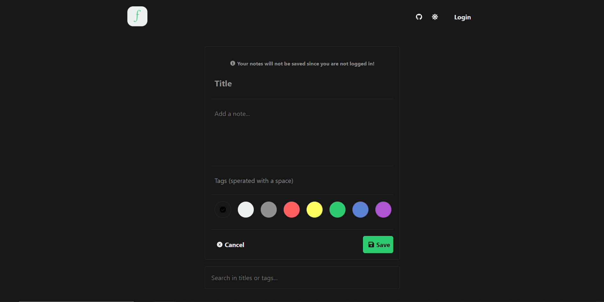
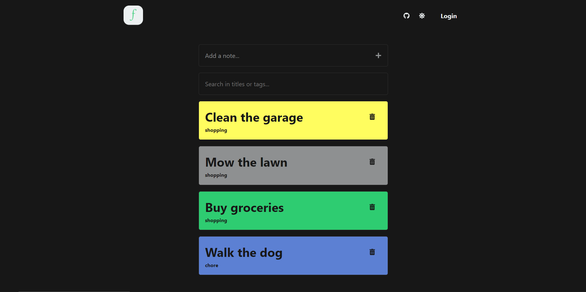
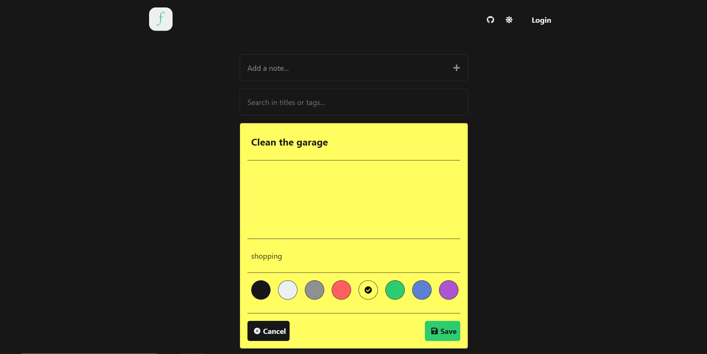

# Fulfil

Fulfil is a classic To-Do application where a user can write down all the things he wants to accomplish.

## Features

-   User can see an `input` field where he can type in a to-do item
-   By pressing enter (or a button), the User can submit the to-do item and can see that being added to a list of to-do's
-   User can mark a to-do as `completed`
-   User can remove a to-do item by pressing on a button
-   User can edit a to-do
-   User can see a list with all the completed to-do's
-   User can see a list with all the active to-do's
-   User can see the date when he created the to-do
-   User can assign custom tags to to-do's
-   User can assign colors to to-do's
-   User can create an account so the to-do's will be stored and when the User returns, the data will be retrieved

## Preview images
Todo form

Todos

Edit todo

#

Backend: https://github.com/TakaoIsDaBest/fulfil-s
